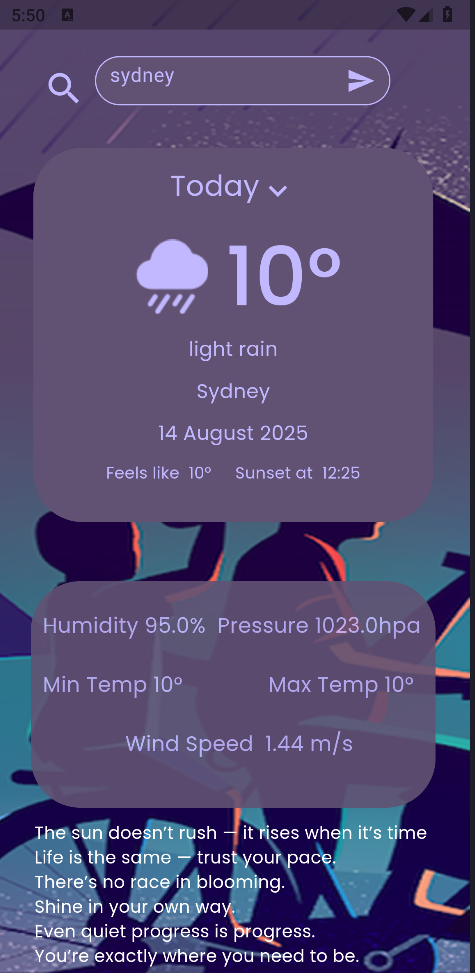
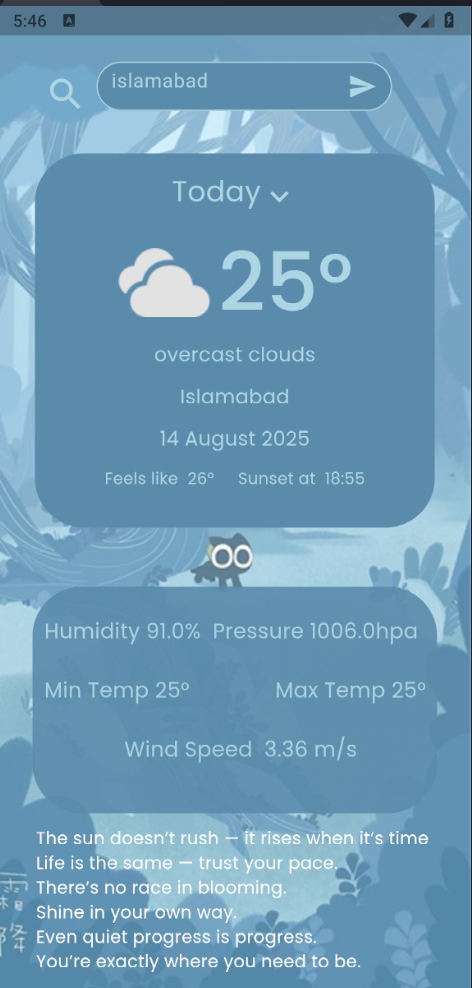
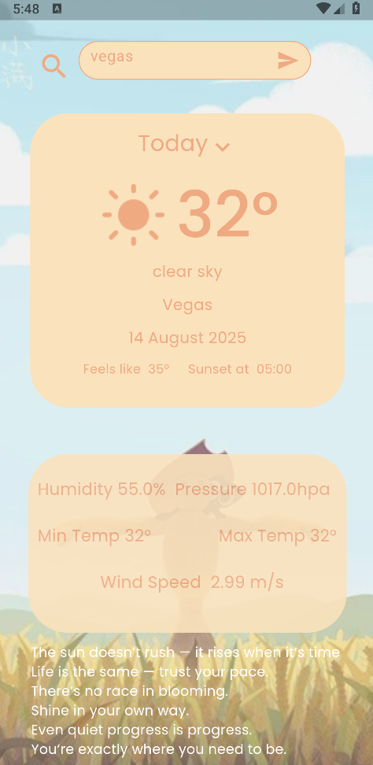

# ☀️🌧 MyWeather – Flutter Weather App

**MyWeather** ek stylish aur simple Flutter app hai jo real-time weather data show karta hai, saath hi beautiful themed backgrounds ke saath jo weather condition ke hisaab se change hota hai.  

---

## 📱 App Screenshots

### 1️⃣ Splash / Welcome Screen


### 2️⃣ Rainy Weather (Example: Sydney)


### 3️⃣ Cloudy Weather (Example: Islamabad)


### 4️⃣ Sunny Weather (Example: Vegas)


---

## ✨ Features
- 🌦 **Real-time Weather Data** (Temperature, humidity, wind speed, etc.)
- 🎨 **Dynamic Themes** based on weather condition
- 🔍 Search by **City Name**
- 📅 **Date & Time Display**
- 📜 **Inspirational Quotes** at the bottom
- 📱 **Beautiful UI** with smooth design

---

## 🚀 Getting Started

**Clone the repository**:
```bash
git clone https://github.com/YourUsername/YourRepositoryName.git


